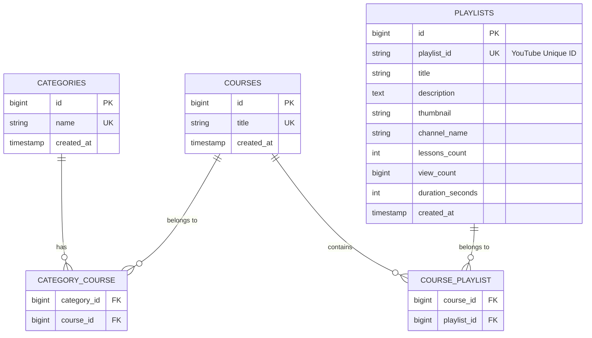
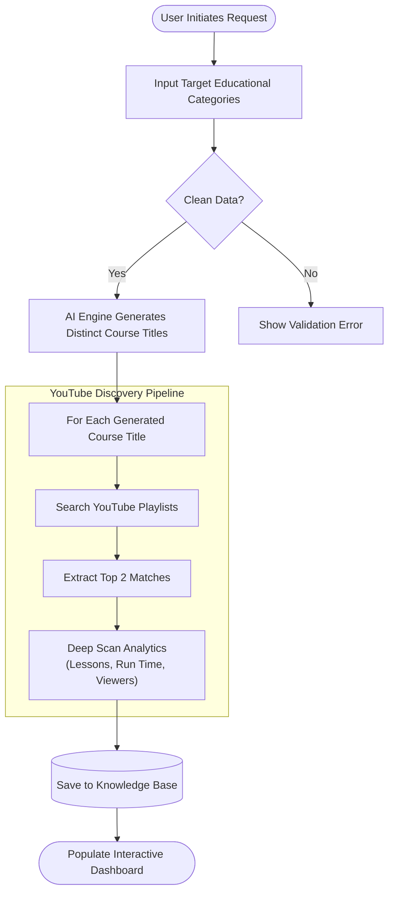
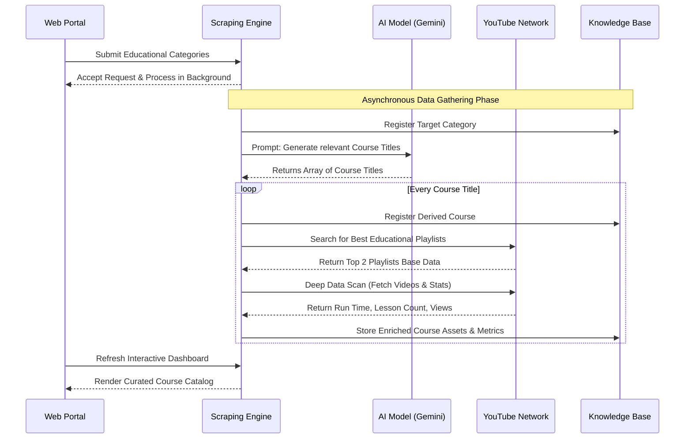

# YouTube Course Scraper

## Table of Contents
- [Overview](#overview)
- [🏗️ Architecture Diagrams](#️-architecture-diagrams)
  - [1. Entity Relationship Diagram (ERD)](#1-entity-relationship-diagram-erd)
  - [2. General System Flowchart](#2-general-system-flowchart)
  - [3. Execution Sequence Diagram](#3-execution-sequence-diagram)
- [🚀 Setup & Installation Documentation](#-setup--installation-documentation)
  - [Prerequisites](#prerequisites)
  - [Step-by-Step Installation](#step-by-step-installation)
  - [🏃 Running the Project](#-running-the-project)
  - [Usage](#usage)
- [🧪 Testing Suite](#-testing-suite)
  - [1. Database & Logic Tests (Fast)](#1-database--logic-tests-fast)
  - [2. External Integration Tests (Slow / Live)](#2-external-integration-tests-slow--live)

## Overview

**YouTube Course Scraper** is a Laravel-based web application that discovers educational YouTube playlists (courses) automatically using AI-generated search queries. Users can submit high-level topics or categories (e.g., Programming, Marketing, Engineering) into a custom Arabic Right-to-Left (RTL) interface. 

The application utilizes the **Laravel AI SDK (Gemini)** to transform these generalized categories into specific, highly relevant course search terms in both Arabic and English. It then interacts with the **YouTube Data API v3** to discover and persist the top matching YouTube playlists into the database, handling duplicates seamlessly. 

Recently, the engine was heavily upgraded to compute deep analytics per playlist (total lessons, cumulative views, and exact ISO 8601 cumulative durations). To support stability, **Repository Pattern Architecture** strictly governs all internal Database IO operations. Additionally, the system now features **Real-time WebSockets via Laravel Reverb**, which instantly alerts frontend users if any background queue scraping processes encounter errors or API limitations.

---

## 🏗️ Architecture Diagrams

### 1. Entity Relationship Diagram (ERD)



The database schema is designed following the 3rd Normal Form (3NF) principles by utilizing Many-to-Many relationships to eliminate data redundancy and ensure transitive dependency resolution across Categories, Courses, and Playlists.

### 2. General System Flowchart



### 3. Execution Sequence Diagram



---

## 🚀 Setup & Installation Documentation

### Prerequisites
- PHP 8.3+
- Composer
- MySQL Database Engine
- Node.js & NPM
- YouTube Data API v3 Key
- Gemini API Key

### Step-by-Step Installation

1. **Clone the Directory**  
   Clone this repository to your local machine and CD into the destination directory.
   ```bash
   git clone <repository_url>
   cd YoutubeScrapperTask
   ```

2. **Install Dependencies**  
   Install the necessary PHP Composer and Node requirements (for the WebSocket UI).
   ```bash
   composer install
   npm install && npm run build
   ```

3. **Environment Setup**  
   Copy the example environment file if you haven't already:
   ```bash
   cp .env.example .env
   ```
   Generate application key:
   ```bash
   php artisan key:generate
   ```

4. **Configure the Database**  
   Update your `.env` to match your local database authentication:
   ```env
   DB_CONNECTION=mysql
   DB_HOST=127.0.0.1
   DB_PORT=3306
   DB_DATABASE=youtube_scrapper
   DB_USERNAME=root
   DB_PASSWORD=YourPassword
   ```

5. **Configure API Keys**  
   At the very bottom of your `.env` file, supply your AI & YouTube credentials. The Application relies on Gemini for NLP logic.
   Google API endpoints and global environment keys are securely mapped in `config/youtube.php`.
   ```env
   GEMINI_API_KEY="[GCP_API_KEY]"
   YOUTUBE_API_KEY="[GCP_API_KEY]"
   ```
   *Tip: Remember to navigate to your Google Cloud Console to restrict your API Key.*

6. **Execute Database Migrations**  
   Run the migration command to execute all Database schemas ensuring they fall into correct relational execution steps (including the Pivot Tables and Queue defaults):
   ```bash
   php artisan migrate:fresh
   ```

### 🏃 Running the Project

To execute the project, you need three separate terminal windows. One server will process the web interactions, another will process the heavy queued background API requests, and the third runs the real-time WebSocket server.

**Terminal 1: Start Laravel Development Web Server**
```bash
php artisan serve
```
Open your browser to `http://127.0.0.1:8000/`.

**Terminal 2: Start The Background Queue Worker**
Because querying the AI and hitting YouTube's endpoints is extremely heavy (with baked-in HTTP throttles & `sleep()` sequences preventing 429 limits), all data collection operates asynchronously inside resilient timeout workers.
```bash
php artisan queue:work
```

**Terminal 3: Start The WebSockets Server**
To push real-time error notifications to the user interface when scraping tasks fail, Laravel Reverb (Pusher protocol) must be running.
```bash
php artisan reverb:start
```

### Usage
- Once the application is up, navigate to the web interface. 
- Paste or type in topics/categories inside the prompt area (1 per line).
- Hit **ابدأ الجمع** (Start Fetching). 
- Observe the Queue terminal processing jobs! Refresh the browser once they complete to see your populated customizable grid tiles containing native YouTube links, absolute playtime calculations, and cumulative viewership!

---

## 🧪 Testing Suite

This application utilizes **PEST PHP** for testing to ensure maximum reliability of background queues and data integrity.

### 1. Database & Logic Tests (Fast)
These are securely mocked tests that spin up incredibly fast. They intercept the queue, mock the external Artificial Intelligence and YouTube API boundaries, and specifically verify your application's internal Pivot Database architecture accurately records constraints (e.g., verifying 15 courses correctly map to 30 strictly related playlists). These run against a dedicated `youtube_scrapper_testing` MySQL database to prevent polluting your local environment.

```bash
# Run the core API and Queue Dispatch logic
php artisan test --filter ScrapeApiTest

# Run pure Job execution logic
php artisan test tests/Unit/ScrapeCategoryJobTest.php
```

### 2. External Integration Tests (Slow / Live)
If you need to strictly verify that your Google Cloud and YouTube v3 API Keys are active and returning the correct structured JSON boundaries, you can execute the live Integration tests. 
*Note: This will actually consume real API quota and intentionally trigger Google rate-limiting `sleep()` methods to bypass 429 errors.*

```bash
# Force the system to actually hit the real Gemini & YouTube Data APIs
php artisan test tests/Feature/ThirdPartyIntegrationTest.php
```
